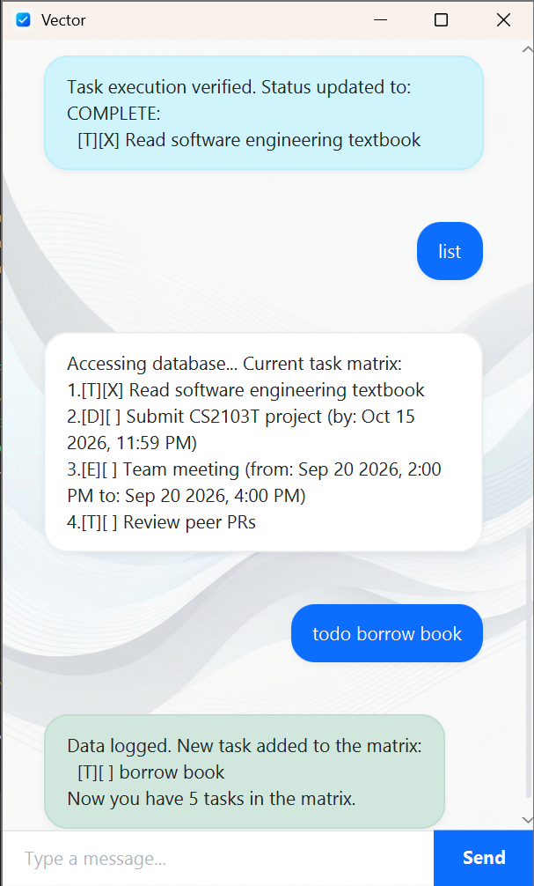

# Vector User Guide



Vector is a desktop app for managing tasks, optimized for use via a Command Line Interface (CLI) while still having the benefits of a Graphical User Interface (GUI). If you can type fast, Vector can get your task management duties done faster than traditional GUI apps.

## Quick Start

1. Ensure you have Java `17` or above installed in your Computer.
2. Download the latest `vector.jar` from the releases.
3. Open a command terminal, navigate to the folder where you saved the jar file, and use the `java -jar vector.jar` command to run the application, or simply double-click the jar file.
4. Type the command in the command box and press Enter to execute it. 
5. See the **Features** section below for details of each command.

---

## Features

> [!NOTE]
> **Date and Time Format Requirements**
> Whenever a command requires a date and time, you must use one of the following formats:
> - `yyyy-MM-dd HHmm` (e.g., `2026-10-15 2359`)
> - `d/M/yyyy HHmm` (e.g., `15/10/2026 2359`)
> 
> The time component is optional. If omitted (e.g., `2026-10-15`), Vector will default the time to the start of the day (00:00).

### Adding a To-Do: `todo`

Adds a to-do task to the task list. To-dos are tasks without any date/time attached to them.

**Format:** `todo DESCRIPTION`

**Example:**
`todo Read software engineering textbook`

**Expected Outcome:**
```
Data logged. New task added to the matrix:
  [T][ ] Read software engineering textbook
Now you have 1 tasks in the matrix.
```

### Adding a Deadline: `deadline`

Adds a deadline task that needs to be done before a specific date/time.

**Format:** `deadline DESCRIPTION /by DATE_TIME`

**Example:**
`deadline Submit CS2103T project /by 2026-10-15 2359`

**Expected Outcome:**
```
Data logged. New task added to the matrix:
  [D][ ] Submit CS2103T project (by: Oct 15 2026, 11:59 PM)
Now you have 2 tasks in the matrix.
```

### Adding an Event: `event`

Adds an event task that starts at a specific time and ends at a specific time.

**Format:** `event DESCRIPTION /from START_DATE_TIME /to END_DATE_TIME`

**Example:**
`event Team meeting /from 2026-09-20 1400 /to 2026-09-20 1600`

**Expected Outcome:**
```
Data logged. New task added to the matrix:
  [E][ ] Team meeting (from: Sep 20 2026, 2:00 PM to: Sep 20 2026, 4:00 PM)
Now you have 3 tasks in the matrix.
```

### Listing all tasks: `list`

Shows a list of all tasks currently stored in the task matrix.

**Format:** `list`

**Expected Outcome:**
```
Accessing database... Current task matrix:
1.[T][ ] Read software engineering textbook
2.[D][ ] Submit CS2103T project (by: Oct 15 2026, 11:59 PM)
3.[E][ ] Team meeting (from: Sep 20 2026, 2:00 PM to: Sep 20 2026, 4:00 PM)
```

### Marking a task as done: `mark`

Marks a specified task as completed.

**Format:** `mark INDEX`
* `INDEX` must be a valid task number shown in the `list` command.

**Example:**
`mark 1`

**Expected Outcome:**
```
Task execution verified. Status updated to: COMPLETE:
  [T][X] Read software engineering textbook
```

### Unmarking a task: `unmark`

Reverts a completed task back to an incomplete state.

**Format:** `unmark INDEX`

**Example:**
`unmark 1`

**Expected Outcome:**
```
Task execution reverted. Status updated to: INCOMPLETE:
  [T][ ] Read software engineering textbook
```

### Deleting a task: `delete`

Deletes the specified task from the task matrix.

**Format:** `delete INDEX`

**Example:**
`delete 3`

**Expected Outcome:**
```
Task eliminated from the matrix:
  [E][ ] Team meeting (from: Sep 20 2026, 2:00 PM to: Sep 20 2026, 4:00 PM)
Now you have 2 tasks in the matrix.
```

### Finding tasks by keyword: `find`

Finds tasks whose description contains the given keyword.

**Format:** `find KEYWORD`

**Example:**
`find project`

**Expected Outcome:**
```
Scanning database for keyword 'project'. Matches found:
1.[D][ ] Submit CS2103T project (by: Oct 15 2026, 11:59 PM)
```

### Scheduling tasks by date: `schedule`

Lists all tasks (deadlines and events) that occur on a specific date. 

**Format:** `schedule DATE`
* The date must be in `yyyy-MM-dd` or `d/M/yyyy` format.

**Example:**
`schedule 2026-10-15`

**Expected Outcome:**
```
Scanning schedule for 2026-10-15. Results:
1.[D][ ] Submit CS2103T project (by: Oct 15 2026, 11:59 PM)
```

### Exiting the program: `bye`

Exits the program.

**Format:** `bye`

---

## Data Persistence

Vector automatically saves your task matrix to your hard disk after any command that changes the data. There is no need to manually save your work. The data is stored locally in the `data/vector.txt` file within the same directory as the application.